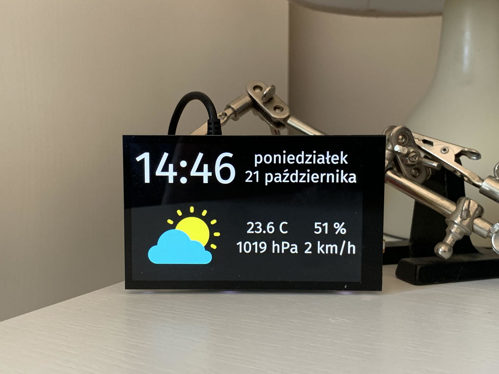

# HomeStation 2

🌞 Time and weather for everyone! ⁽ʷʰᵒ ʰᵃˢ ᵃ ˢᵖᵃʳᵉ ʳᵃˢᵖᵇᵉʳʳʸ ᵖᶦ⁾

When I found about the [HyperPixel 4](https://shop.pimoroni.com/products/hyperpixel-4) (a touchscreen for Raspberry Pi),
I immediately thought to myself `hi, me from the past - why don't we create a nice little touch-y weather station like
you always wanted?`; I put my shoulder to the wheel and ended up with this little toy.

Side note: this is a direct successor to my [HomeStation 1](https://github.com/Patryk27/home-station-1).

Side note #2: powered by [Rust](https://github.com/rust-lang/rust) and
[Conrod](https://github.com/PistonDevelopers/conrod).

## Station in action

## Goals

- **Free** - as in "free beer"
- **Simple**
- **Resource-inexpensive** (I run it on my RPi Zero and typical CPU usage is around 10% - I've got a few optimization
  ideas coming though!)

## Roadmap

- Implement integration with [Airly](https://airly.eu/map/pl/)
- Implement an additional screen that pops up after touching the weather icon, which will show weather predicted for the
  day

## Setting up

See: [docs/setting-up.md](docs/setting-up.md)

## Architecture

See: [docs/architecture.md](docs/architecture.md)

## Contributing

See: [docs/contributing.md](docs/contributing.md)

## Credits

- Weather icons: <https://www.iconfinder.com/iconsets/weather-flat-14>

## License

Copyright (c) 2019, Patryk Wychowaniec, wychowaniec.patryk@gmail.com.    
Licensed under the MIT / Postcardware license.
